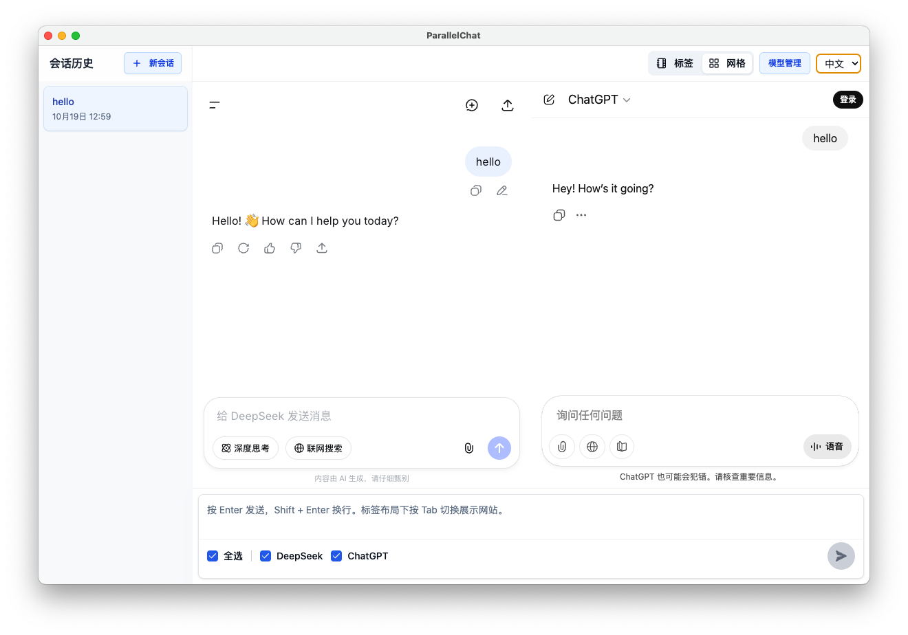
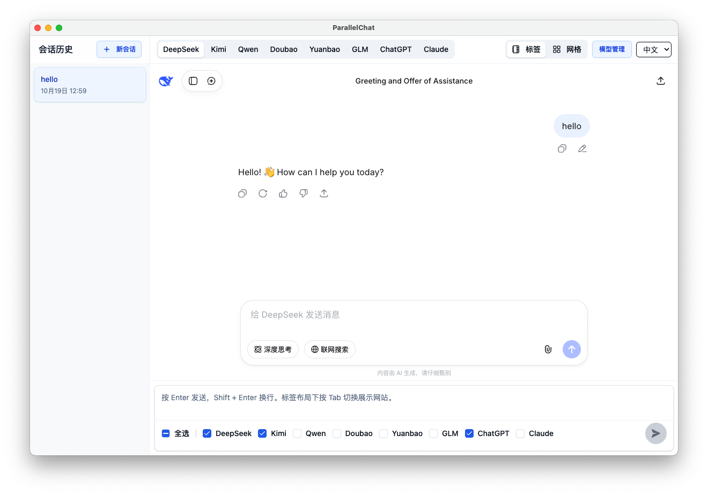

<p align="center">
  
</p>

<h1 align="center">ParallelChat：一题多解，灵感并行</h1>

<p align="center">思想并行，灵感不止——不止一个答案，不止一种可能。</p>

**语言**: **中文** | [English](README_EN.md)


---

## 为什么选择 ParallelChat
- 零成本使用：直接与各大 AI 官网交互，无需 API、无需 Token，享受官方最新功能。
- 并排对比 + 标签切换：网格布局并排查看多个回答，或用标签在不同模型间快速切换。
- 广播输入：一个问题可同时发送到多个 AI，省时又省力。
- 会话与缓存隔离：每个会话独立保存状态，支持一键清除所有缓存与登录信息。
- 多模型覆盖：ChatGPT、Claude、DeepSeek、Kimi、通义千问、智谱 GLM、豆包等。

## 核心功能
- 并行对比多个 AI 回复：支持网格/瀑布与标签页布局切换。
- 全局输入栏广播：选择目标视图，一键发送；支持图片或文件上传。
- 会话侧边栏：新建/重命名/删除；切换自动恢复各 AI 页面的状态。
- 缓存管理：可清除单个或全部 AI 的缓存与登录信息，保障隐私与可控性。

## 界面预览
<p align="center">
  
</p>
<p align="center">
  
</p>

## 支持的模型与站点
- ChatGPT、Claude、DeepSeek、Kimi、通义千问（Qwen）、智谱 GLM、豆包等主流模型均可在并行视图中使用。
- 直接使用各官网的最新体验，无需任何密钥或额外费用。

## 下载与安装
- Windows：访问官网下载安装包 <https://parallelchat.top/>
- MacOS：即将推出，敬请期待！

## 开发者本地运行
- 环境要求：`Node >= 14.x`，`npm >= 7.x`
- 安装与启动：
  ```bash
  npm install
  npm start
  ```
- 开发模式会同时启动主进程与渲染进程并打开应用窗口。

## 构建与发布
```bash
# 本地打包（根据当前平台生成安装包）
npm run package

# 原生模块重建（如依赖了 native 模块）
npm run rebuild
```

## 快速使用
- 添加 AI：在模型管理中启用AI，接的登录启用的AI。
- 广播提问：在底部全局输入框输入内容，选择要接收广播的 AI，点击发送或按快捷键。
- 布局切换：右上角布局按钮在 网格 与 标签页 间切换。
- 会话管理：首次发送自动生成会话；侧边栏支持重命名与删除，并在切换时恢复各 AI 页面状态。
- 清除缓存：设置页支持清除单个或全部 AI 的缓存与登录信息。

## 常见问题（FAQ）
- 是否需要 API 或 Token？不需要，直接通过各 AI 官网交互。
- 能否扩展更多模型？暂不提供自定义扩展，可以提交issue，会考虑支持。
- 我的数据会被保存吗？会话与缓存保存在本地，可随时清理；登录信息留存在各官网的 Web 会话中。
- 为什么不能使用 Google 账号登录？Google 账号限制了在 Electron 应用中使用，因此无法登录。对于 Qwen、GPT、Grok、Claude 可以使用非 Google 账号登录；对于 Gemini，目前没有可行的登录方式。
