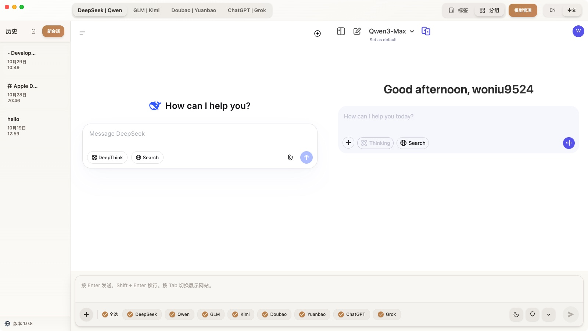

<p align="center">
  
</p>

<h1 align="center">ParallelChat</h1>

<p align="center">
  <strong>一次提问，多个 AI 同时作答</strong><br>
  <em>不止一个答案，不止一种可能</em>
</p>

<p align="center">
  <strong>语言</strong>: <strong>中文</strong> | <a href="README_EN.md">English</a>
</p>

---

<p align="center">
  
</p>

---

## 简介

ParallelChat 是一个多 AI 协作助手，让你在同一个界面里并行使用多个主流模型，快速对比与取长补短，避免在不同网站之间来回切换、复制粘贴的痛点。

- 目标：高效比较、快速决策、提升创作与推理质量
- 方式：直接与各 AI 官网交互，保持原生体验与最新能力

---

## 特性

- 完全免费：无需 `API Key` 与 `Token` 费用，直接使用官网能力
- 主流模型齐全：支持 DeepSeek、Qwen、GLM、Kimi、Doubao、Yuanbao、ChatGPT、Grok 等
- 官方原味体验：基于各官网接口与 Web 会话，能力同步且纯净无广告
- 两种使用模式：标签模式与分组模式，按场景自由切换
- 快捷操作：顶栏标签可用 `Tab` 快速切换，提高浏览效率
- 本地数据：会话与缓存保存在本地，随时清理；登录信息保留在各官网 Web 会话中

---

## 快速开始

1) 下载并安装：访问官网 [https://parallelchat.top/](https://parallelchat.top/)
2) 打开模型管理：在应用中启用你需要的 AI 模型
3) 选择使用模式：根据场景选择标签模式或分组模式
4) 登录账号：在相应页面登录对应 AI 的账号后即可使用
5) 小技巧：按 `Tab` 在顶部标签间快速切换，无需频繁点鼠标

---

## 使用模式

### 标签模式（适合专注查看单个回答）
- 每个 AI 独立页面，互不干扰，界面简洁；适合深入阅读与长对话。

### 分组模式（强烈推荐，用于对比）
- 多个 AI 集中在同一页，直观对比观点与质量。
- 内置四组：
  - DeepSeek | Qwen
  - GLM | Kimi
  - Doubao | Yuanbao
  - ChatGPT | Grok
- 你也可以按喜好自由调整分组与顺序。

---

## 注意事项

- 无法使用 Google 账号登录：Google 账号在 Electron 应用中受限，暂不可用。
- 对于 Qwen、GPT、Grok、Claude：可使用非 Google 账号登录；Gemini 暂无可行登录方式。
- 直接使用各官网的最新能力；无需任何密钥或额外费用。

---

## 开发者指南

在本地运行：

```bash
# 安装依赖
npm install

# 启动开发模式
npm start
```

---

## 常见问题（FAQ）

<details>
<summary><strong>是否需要 API 或 Token？</strong></summary>
<br>
不需要。ParallelChat 通过与各 AI 官网交互来提供服务，完全免费使用。
</details>

<details>
<summary><strong>能否扩展更多模型？</strong></summary>
<br>
暂不提供自定义扩展。你可以提交 issue，我们会评估与考虑支持。
</details>

<details>
<summary><strong>我的数据会被保存吗？</strong></summary>
<br>
会话与缓存保存在本地，可随时清理；登录信息留存在各官网的 Web 会话中。
</details>

<details>
<summary><strong>为什么不能使用 Google 账号登录？</strong></summary>
<br>
Google 账号限制了在 Electron 应用中使用，因此无法登录。对于 Qwen、GPT、Grok、Claude 可使用非 Google 账号；Gemini 暂无可行登录方式。
</details>

---

## 隐私与数据

- 本地优先：聊天记录与缓存存储于本地，可在设置中清理。
- 会话规则：登录信息保存在各 AI 官网的 Web 会话中，不会被应用上传到第三方。
- 你完全掌控：随时退出登录或清理本地数据。

---

## 愿景

**​多一个答案，多一种可能。​**

让不同AI的智慧相互碰撞，激发你的灵感，帮你找到那个最契合需求的回答。尽情尝试、自由比较。把省下的时间，留给生活、陪伴与自己。

---
<p align="center">
  <strong>ParallelChat - 让 AI 协作变得简单而美好</strong>
</p>
