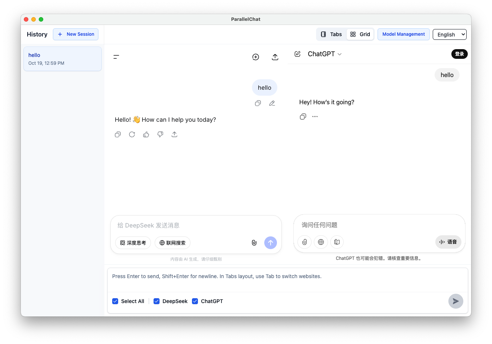
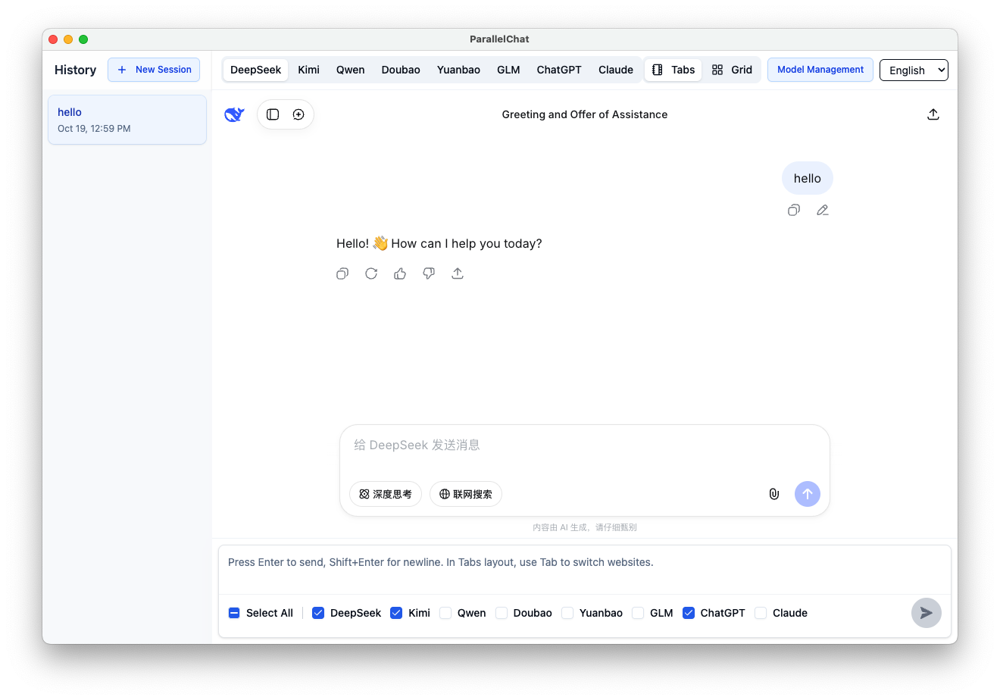

<p align="center">
  
</p>

<h1 align="center">ParallelChat: Multiple Solutions, Parallel Inspiration</h1>

<p align="center">Parallel thinking, endless inspiration — more than one answer, more than one possibility.</p>

**Language**: [中文](README.md) | **English**

---

## Why Choose ParallelChat
- **Zero Cost Usage**: Interact directly with major AI official websites, no API or Token required, enjoy the latest official features.
- **Side-by-Side Comparison + Tab Switching**: Grid layout for viewing multiple responses side by side, or use tabs to quickly switch between different models.
- **Broadcast Input**: Send one question to multiple AIs simultaneously, saving time and effort.
- **Session & Cache Isolation**: Each session saves state independently, supports one-click clearing of all cache and login information.
- **Multi-Model Coverage**: ChatGPT, Claude, DeepSeek, Kimi, Qwen, GLM, Doubao, and more.

## Core Features
- **Parallel AI Response Comparison**: Support grid/waterfall and tab layout switching.
- **Global Input Bar Broadcasting**: Select target views, send with one click; supports image or file upload.
- **Session Sidebar**: Create/rename/delete; switching automatically restores each AI page's state.
- **Cache Management**: Clear individual or all AI cache and login information, ensuring privacy and control.

## Interface Preview
<p align="center">
  
</p>
<p align="center">
  
</p>

## Supported Models & Sites
- ChatGPT, Claude, DeepSeek, Kimi, Qwen, GLM, Doubao and other mainstream models can all be used in parallel view.
- Directly use the latest experience from each official website, no keys or additional fees required.

## Download & Installation
- **Windows**: Visit official website to download installer <https://parallelchat.top/>
- **MacOS**: Coming soon, stay tuned!

## Developer Local Setup
- **Requirements**: `Node >= 14.x`, `npm >= 7.x`
- **Install & Start**:
  ```bash
  npm install
  npm start
  ```
- Development mode will start both main process and renderer process and open the application window.

## Build & Release
```bash
# Local packaging (generate installer for current platform)
npm run package

# Native module rebuild (if native modules are dependencies)
npm run rebuild
```

## Quick Start
- **Add AI**: Enable AI in model management, then login to the enabled AI.
- **Broadcast Questions**: Enter content in the bottom global input box, select AIs to receive broadcast, click send or use shortcut.
- **Layout Switch**: Layout button in top right corner switches between Grid and Tab views.
- **Session Management**: First send automatically generates session; sidebar supports rename and delete, restores each AI page state when switching.
- **Clear Cache**: Settings page supports clearing individual or all AI cache and login information.

## Frequently Asked Questions (FAQ)
- **Do I need API or Token?** No, interact directly through each AI's official website.
- **Can I extend more models?** Custom extensions are not currently provided, you can submit an issue and we'll consider support.
- **Will my data be saved?** Sessions and cache are saved locally and can be cleared at any time; login information remains in each official website's web session.
- **Why can't I use Google account login?** Google accounts restrict usage in Electron applications, so login is not possible. For Qwen, GPT, Grok, Claude you can use non-Google accounts to login; for Gemini, there's currently no viable login method.