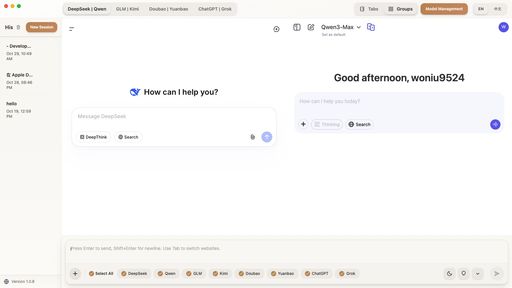

<p align="center">
  
</p>

<h1 align="center">ParallelChat</h1>

<p align="center">
  <strong>One question, multiple AIs answer in parallel</strong><br>
  <em>More than one answer, more than one possibility</em>
</p>

<p align="center">
  <strong>Language</strong>: <a href="README.md">中文</a> | <strong>English</strong>
</p>

---

<p align="center">
  
</p>

---

## Introduction

ParallelChat is a multi‑AI collaboration assistant that lets you use several mainstream models side by side in one interface. Compare quickly, cross‑pollinate strengths, and avoid the pain of switching between different sites and copy‑pasting.

- Goal: efficient comparison, faster decisions, higher‑quality creation and reasoning
- Approach: interact directly with each AI’s official website to preserve a native experience and the latest capabilities

---

## Features

- Completely free: no `API Key` or `Token` costs; use official website capabilities directly
- Broad model coverage: supports DeepSeek, Qwen, GLM, Kimi, Doubao, Yuanbao, ChatGPT, Grok, and more
- Authentic official experience: based on each site’s interfaces and web sessions; capabilities in sync, clean and ad‑free
- Two modes: Tab view and Group view, switch freely by scenario
- Quick navigation: use the `Tab` key to quickly switch the top tabs and speed up browsing
- Local data: sessions and cache are stored locally and can be cleared anytime; login information remains in each official website’s web session

---

## Quick Start

1) Download and install: visit the official site <https://parallelchat.top/>
2) Open Model Management: enable the AI models you want to use
3) Choose a mode: pick Tab view or Group view based on your needs
4) Log in: sign in to each AI on its page and start chatting
5) Tip: press `Tab` to quickly switch between top tabs without frequent mouse clicks

---

## Modes

### Tab View (best for focusing on a single answer)
- Each AI opens in its own independent page, clean and distraction‑free; suitable for deep reading and long conversations.

### Group View (strongly recommended for comparison)
- Multiple AIs on the same page for intuitive comparison of viewpoints and quality.
- Built‑in groups:
  - DeepSeek | Qwen
  - GLM | Kimi
  - Doubao | Yuanbao
  - ChatGPT | Grok
- You can customize groups and order to your preference.

---

## Notes

- Google account login is unavailable: Google sign‑in is restricted in Electron apps and is currently not supported.
- For Qwen, GPT, Grok, Claude: use non‑Google accounts; for Gemini there is currently no viable login method.
- Uses the latest capabilities directly from each official website; no keys or extra fees required.

---

## Developer Guide

Run locally:

```bash
# Install dependencies
npm install

# Start in development mode
npm start
```

---

## FAQ

<details>
<summary><strong>Do I need an API or Token?</strong></summary>
<br>
No. ParallelChat interacts with each AI’s official website and is completely free to use.
</details>

<details>
<summary><strong>Can I extend more models?</strong></summary>
<br>
Custom extensions are not currently provided. You can submit an issue and we’ll evaluate support.
</details>

<details>
<summary><strong>Will my data be saved?</strong></summary>
<br>
Sessions and cache are stored locally and can be cleared at any time; login information remains in each official website’s web session.
</details>

<details>
<summary><strong>Why can’t I use a Google account to log in?</strong></summary>
<br>
Google accounts are restricted in Electron applications, so login isn’t possible. For Qwen, GPT, Grok, Claude you can use non‑Google accounts; for Gemini there’s currently no viable login method.
</details>

---

## Privacy & Data

- Local‑first: chat history and cache are stored locally and can be cleared in Settings.
- Session policy: login information stays within each AI’s official website web session and is never uploaded by the app.
- You’re in control: sign out or clear local data at any time.
